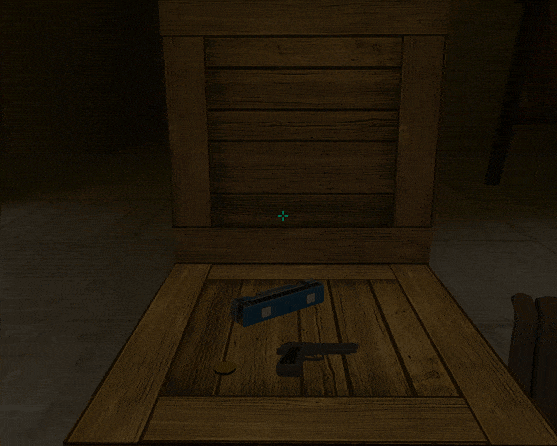

# dx-highlighter
A Deus Ex/System Shock inspired pulsing bounds item highlighter

### Installation

You can use this repo directly via the Unity package manager:
1. In Unity, go to Window > Package Manager
2. Click on the "+" sign in the upper left corner > Add package from git URL
3. Copy the address of this repository: https://github.com/nothke/dx-highlighter and hit Add

Alternatively, you can clone or download this repo and put it in the Packages folder in your Unity project.

### How to Use

1. Add dx_highlighter_canvas prefab to your scene;
2. Reference DXHighlighter, located on that canvas object, in your script;
3. When you want an entire GameObject highlighted, call `highlighter.Highlight(myObject);`. Alternatively, you can add individual Renderers with `highlighter.AddRenderer(myRenderer);`
4. To "unhighlight" everything, call `highlighter.ClearAll()`, or to manually remove renderers `highlighter.RemoveRenderer(myRenderer);`

The highlighter will calculate screen-space bounds of the object and store it in `highlighter.screenBounds`. You can use that value for adding additional features, like item title on screen.

If you want to use the highlighter but with your custom rendering, you can tick manual update in the DXHighlighter component, and then call `highlighter.CalculateBounds()`. You can then obtain resulting screen-space bounds via `highlighter.screenBounds`.

Note: The highlighter is using Unity UI, which is not amazing on performance (but you can use your own rendering method ^)
